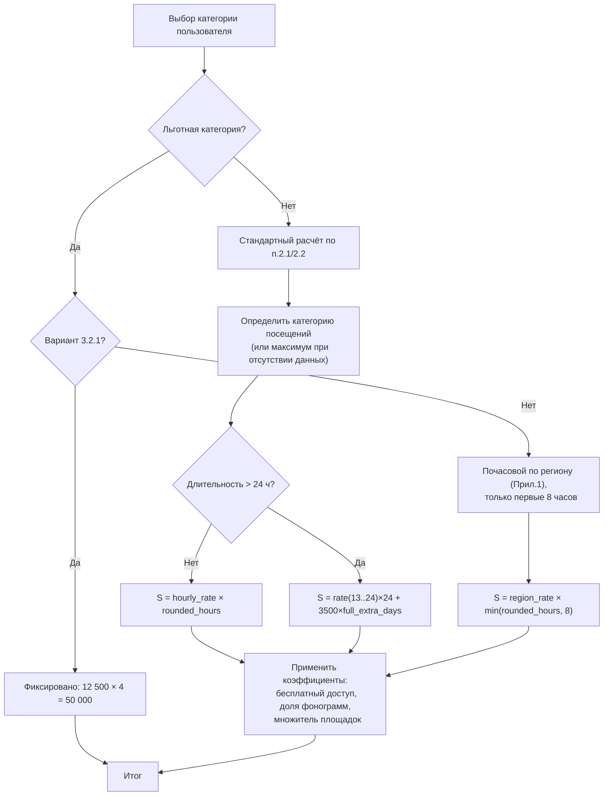

# Логика калькулятора ВОИС для трансляторов мероприятий

## Источник
- Положение: `Положение №5 о ставках ВОИС для онлайн‑трансляторов мероприятий` (утверждено 26.12.2024).
- Рабочий файл анализа: `/Users/Acer/Downloads/Polozhenie-5-o-stavkah-VOIS-OTM.pdf`.

## 1) Входные параметры
- Категория пользователя:
  - стандартная;
  - льготная (п.3.1).
- Для стандартной категории:
  - количество посещений (или флаг «нет достоверных данных»);
  - длительность трансляции в часах;
  - бесплатный/платный доступ;
  - доля фонограмм (%);
  - число площадок: администрируемые + неадминистрируемые;
  - количество трансляций мероприятия (множитель).
- Для льготной категории:
  - вариант 3.2.1 (фикс. квартальная ставка) **или** 3.2.2 (почасовой расчёт по региону);
  - для 3.2.2: регион, длительность, бесплатный/платный доступ, доля фонограмм, площадки, количество трансляций.

## 2) Базовые ставки (п.2.1)
- Берётся часовая ставка по таблице:
  - категория посещений: `до 10 000`, `10 001–100 000`, `100 001–1 000 000`, `свыше 1 000 001`;
  - диапазон длительности: `<=4`, `5..8`, `9..12`, `13..24`.
- Базовая сумма при длительности `<=24`:
  - `S = hourly_rate * rounded_hours`.

## 3) Длительность > 24 часов (п.2.2)
- `S = hourly_rate(13..24) * 24 + 3500 * full_extra_days`,
- где `full_extra_days = floor((rounded_hours - 24) / 24)`.

## 4) Бесплатный доступ (п.2.3)
- Если доступ бесплатный: `S = S * 0.5`.

## 5) Нет достоверных данных о посещениях (п.2.4)
- Используется максимальная категория посещений (`свыше 1 000 001`) с учётом остальных коэффициентов.

## 6) Льготная категория (раздел 3)
- Вариант 3.2.1:
  - `12 500 руб. за квартал`, при оплате за 4 квартала на срок >= 1 года.
  - Годовая сумма в калькуляторе: `50 000 руб.`.
- Вариант 3.2.2:
  - почасовая ставка по региону из Приложения №1;
  - учитываются только первые 8 часов трансляции (п.3.3):
    - `S = region_hourly_rate * min(rounded_hours, 8)`.

## 7) Особенности применения ставок (раздел 4)
- Округление длительности (п.4.1): до ближайшего часа, минимум 1 час.
- Несколько площадок (п.4.2):
  - администрируемые площадки считаются как 1;
  - неадминистрируемые — каждая отдельно;
  - множитель площадок:
    - `K_platform = (has_admin ? 1 : 0) + external_count`,
    - если `K_platform > 1`, то `S = S * K_platform`.
- Количество трансляций:
  - для расчёта за период применяется множитель `K_broadcast = number_of_translations`;
  - итог после коэффициентов: `S = S * K_broadcast`.
- Коэффициент доли фонограмм (п.4.3):
  - `<=19% => 0.6`
  - `20..39% => 0.7`
  - `40..59% => 0.8`
  - `60..79% => 0.9`
  - `>=80% => 1.0`
- П.4.3 не применяется только для варианта 3.2.1.

## 8) Схема

## 9) Принятая реализация в интерфейсе
- Калькулятор `vois_events` использует отдельный профиль ВОИС.
- Формулы, ставки и коэффициенты соответствуют пунктам 2–4 Положения №5.
- UI и шаги унифицированы с калькулятором РАО для трансляторов.
